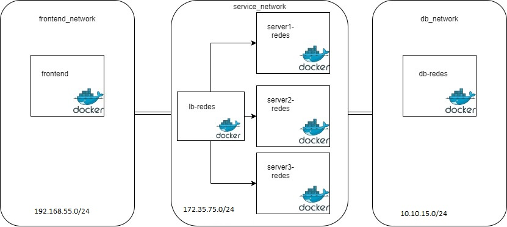
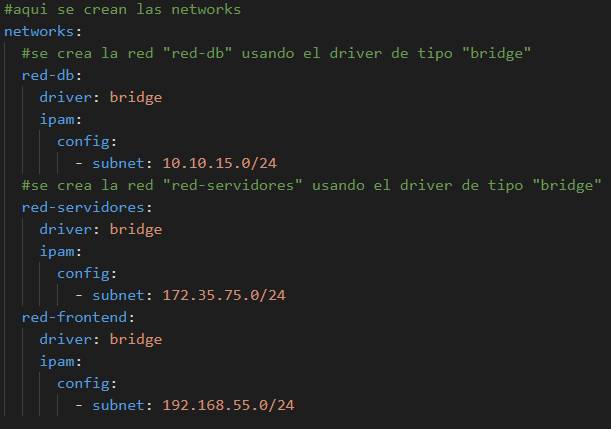
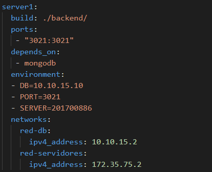
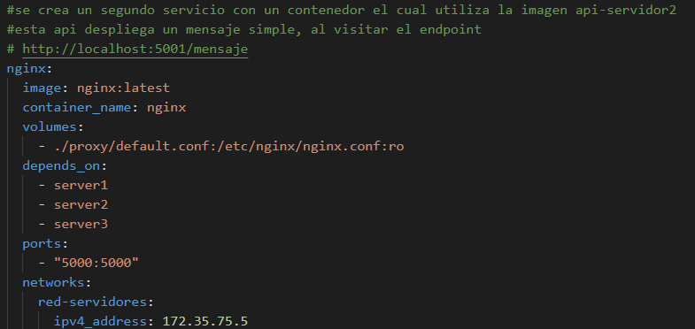

# Manual técnico
* Andhy Lizandro Solis Osorio
* José Carlos Véliz Castro
* Marco Antonio López Grajeda

# Arquitectura

# Comunicación entre contenedores
## Definición de networks
Se definieron 3 networks, una para el frontend, otra para la bd, y una ultima para el manejo de los servicios y load-balancer. 

> Cada vez que se crea una network en docker, este crea un dispositivo bridge. Un bridge es un switch virtual. Cada vez que conecto un contenedor a una network, lo que hace es crear unas virtual ethernet (ve), les asigna una ip a los (ve). El ve para se conecta a su contenedor y al bridge. Las ve se crean en pares. 

> En caso no se especifique una ip, docker asigna una ip que pertenezca a la red especificada. 

## Contenedores en la misma network
La comunicación entre contenedores conectados a una misma network, se puede realizar utilizando el nombre del servicio como host. 

## Definición de servidores

> Cada uno de los 3 servidores utilizan la misma docker-image. La diferencia entre cada uno son las variables de entorno y la ip para comunicarse en la red de servidores y en la red de la base de datos. Un contenedor puede estar conectado a más de una red, por lo tanto, tener más de una ip asignada. Se puede verificar con el comando inspect. 

## Definición de load balancer

> Proxi inverso. Este funciona como balanceador de carga, el cual separa el tráfico que recibe entre un grupo de servidores. Se trata de un load balancer basado en software. Se llevó acabo utilizando Nginx. Este es un servidor web de código abierto. Se utilizó el mecanismo de round-robin para que las solicitudes de distribuyan de esta forma. 

